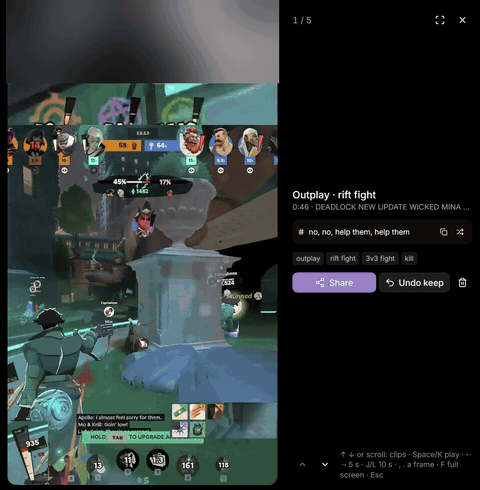
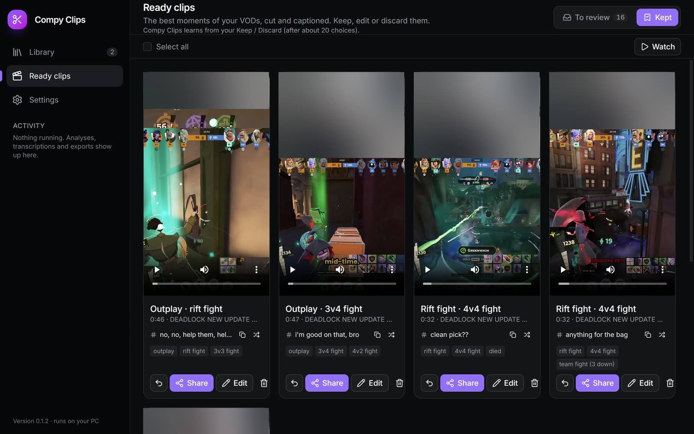
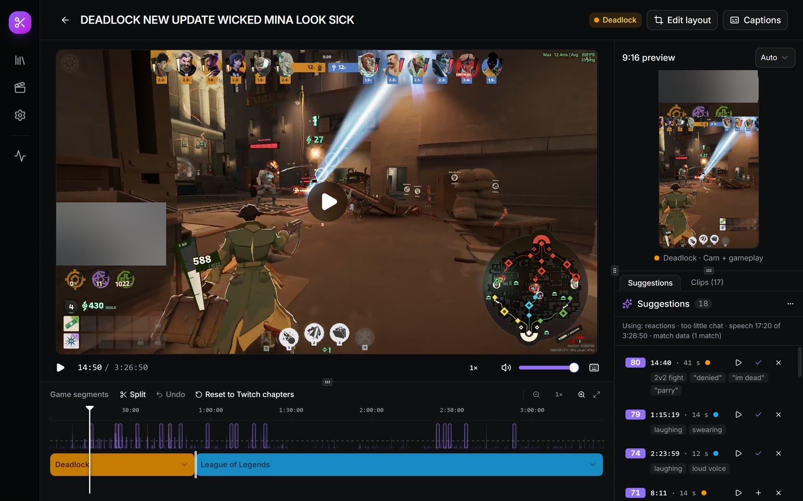

# Compy Clips

A Windows desktop app that finds the best moments in Twitch VODs and turns them into vertical 9:16 clips with captions, ready for TikTok, Instagram Reels and YouTube Shorts. Free, no account; all processing happens on your PC.

**Built by one streamer, using AI.**

  

## What it does

- **Finds moments in Twitch VODs** from a link, without downloading the whole video: it streams the audio and fetches only the video parts it needs.
- **Deadlock gameplay** (the first supported game): fights, kills, deaths, outplays, mid-boss and Rift fights, from the community Deadlock API's match data lined up with the VOD. While you play, it can record your own matches' live data for exact timing. Matches without data are checked by a gameplay vision model.
- **Other games and Just Chatting:** moments from audio, chat and speech (laughter, shouting, chat activity, reactions).
- **Ready clips:** 3–5 clips per hour of stream, 5–60 seconds each, with a 9:16 layout (camera and gameplay), captions and a suggested title. Keep, edit or discard each one; Keep exports the MP4.
- **Captions:** speech recognition on your PC (whisper.cpp, on the graphics card or the CPU). The game's voice lines and sound effects are left out.
- **Editor:** a timeline with game segments and detected moments, trimming, a layout editor, caption styles and a transcript editor. Exports at 1080×1920 or 720×1280, 30 or 60 fps, with the graphics card's encoder.
- **Channel watching:** checks your Twitch channel for new VODs and analyses them by itself; it can run in the tray.
- **Learns your taste:** after about 20 Keep/Discard choices, a small model on your PC reorders the picks.
- **Share:** copies a kept clip to the clipboard for Discord or WhatsApp (as a smaller copy if it's over 10 MB).
- **Stays out of the way:** heavy work pauses while a supported game runs, and the app updates itself.

## Tech stack

| Part | Used |
|---|---|
| App | Tauri 2 (Rust backend), React 19 and TypeScript, Vite, Tailwind CSS, Radix UI |
| Video | FFmpeg (layouts, burned-in captions, hardware H.264 encoding), yt-dlp (Twitch VODs), hls.js (playback) |
| Speech | whisper.cpp (Vulkan or CPU), Silero VAD |
| Sound and vision | ONNX Runtime: CED audio tagging (laughter, shouting); a MobileNetV3 gameplay model trained in PyTorch |
| Game data | The community Deadlock API; Deadlock's live match broadcasts, parsed with Haste (Rust) |
| Ranking | Rule-based scoring plus a per-user logistic regression trained on Keep/Discard choices |
| Updates | Tauri updater (signed updates), NSIS installer |

## Install

1. Download `Compy-Clips-<version>-setup.exe` from **[Releases](https://github.com/SniprMonkey/clipper-releases/releases/latest)** (Windows 10 or 11, 64-bit).
2. Run it. The installer isn't code-signed yet, so Windows SmartScreen may say "Windows protected your PC": click **More info**, then **Run anyway**.
3. Paste a Twitch VOD link, or let it watch your channel. Captions need a speech model (about 0.5–1.6 GB), downloaded once when you choose it.

Compy Clips updates itself from this page (it asks first). The source code is private; this repository hosts the installers and update files.

## Status

Version 0.1, in active development. Deadlock is the first game with gameplay detection.

Planned:
- Gameplay detection for League of Legends, Rocket League, Brawlhalla and Apex Legends, in that order
- A code-signed installer
- A Linux version

## Made with AI

Compy Clips is made by one streamer with AI assistance: AI helped write most of the code, test it and train the gameplay model.

## Privacy

No account and no telemetry. Compy Clips only contacts Twitch (the videos and chat you analyse), the Deadlock API and Valve (match data, Steam profile pictures, the live broadcast of your own matches), GitHub (updates) and Hugging Face (speech models you choose to download). Your clips stay on your PC.

## Licences

Compy Clips is free to use but not open source: © 2026 Hayk Balt, all rights reserved. Use is covered by the licence terms the installer shows. It includes open-source programs and libraries, each under its own licence: the full list is in `THIRD-PARTY-NOTICES.txt` in the installation folder (also in Settings › About).

FFmpeg is included under the GNU GPL version 3. Its source code, the build scripts and the source of every library built into it are in the **[FFmpeg source release](https://github.com/SniprMonkey/clipper-releases/releases/tag/ffmpeg-n9.0.2-3-sources)**.

yt-dlp's Windows program bundles GPL code, so it's included under the GNU GPL version 3 or later too. Its complete source (yt-dlp, the Python packages it bundles, Python and PyInstaller) is attached to every release.

## Author

Hayk Balt ([@SniprMonkey](https://github.com/SniprMonkey)). Questions or problems: [open an issue](https://github.com/SniprMonkey/clipper-releases/issues).

---

Compy Clips isn't affiliated with or endorsed by Valve, Twitch, TikTok, Instagram, YouTube, Riot Games or any other company named here. Only clip content you have the rights to.
